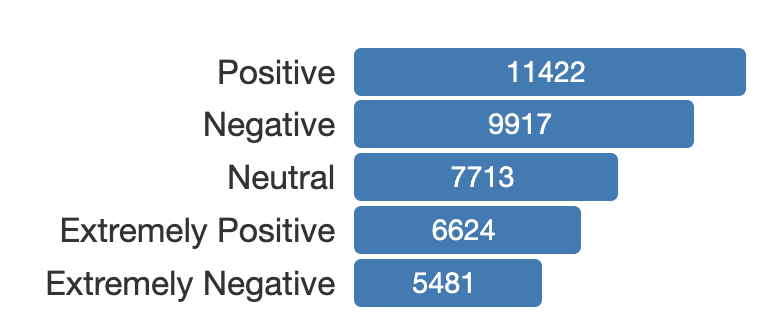
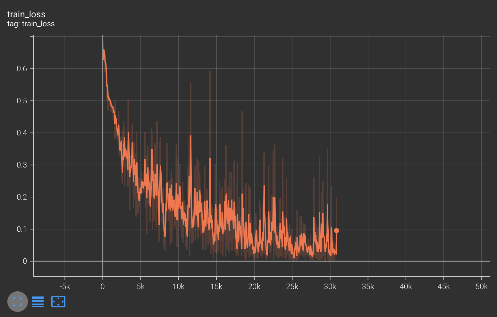
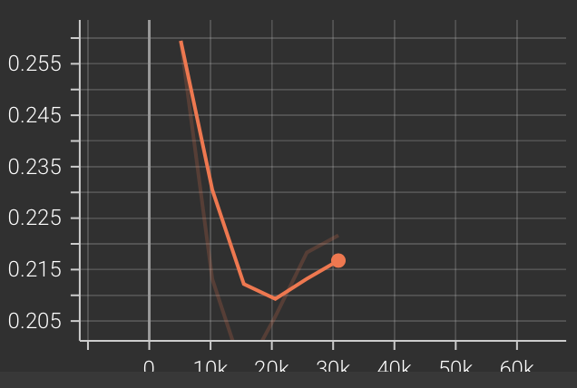
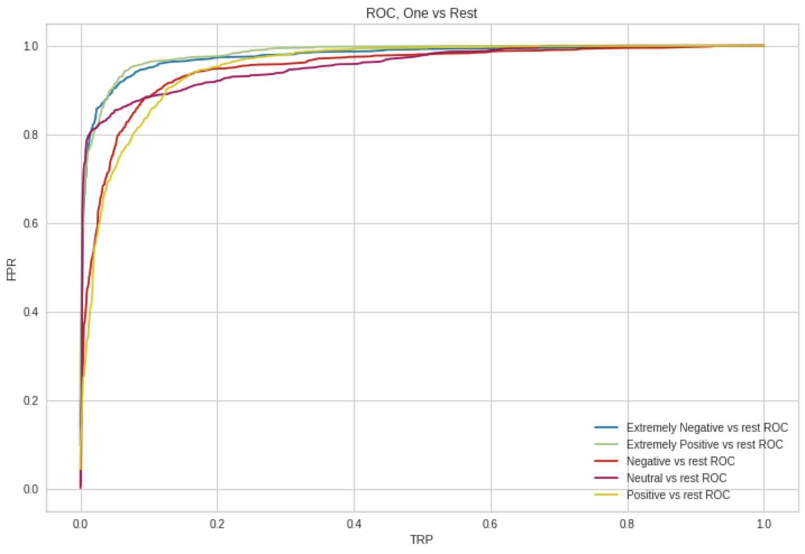
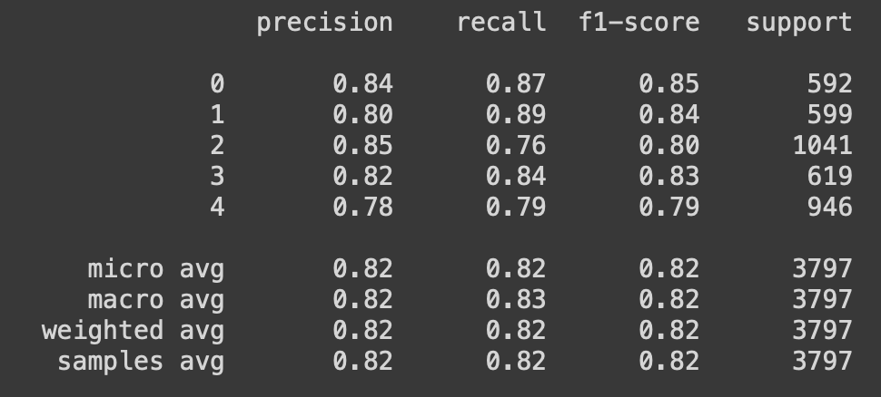

# Sentiment analysis for coronavirus tweets

## Objectives
- learn more about BERT and transformers architecture
- apply BERT to sentiment analysis task
- revise PyTorch workflow for training and evaluating ML models

## New technologies learned
- Pandas Profiling: amazing reports on raw data, helps to find high correlated features, missing values, defines categorical features
- PyTorch Lightning: powerful library for training complex neural networks and research

## Data
[Data](https://www.kaggle.com/datasets/datatattle/covid-19-nlp-text-classification)

### Columns
1) Location
2) Tweet At (date)
3) Original Tweet
4) Label (sentiment from )
5) ScreenName - id - all unique
6) UserName - encoded username - all unique

"The tweets have been pulled from Twitter and manual tagging has been done then. The names and usernames have been given codes to avoid any privacy concerns."

41157 train samples, 3798 test samples

## Preprocessing

Preprocessing done using Pandas Profiling

```python
profile = ProfileReport(train_data, title='Tweets Sentiment analysis, coronavirus data')
```

- dropped UserName, ScreenName, because they're all unique values. Maybe if users were limited, one user could be more negative in general than the other, so this column could be helpful
- dropped Location and TweetAt for the first model, because I don't think they're useful in sentiment analysis. However, location may say sth about general "mood" of country, more negative or more positive. Time also is valuable, as some tweets can be a reaction to news. But I do not have such data, so this column is pretty useless.
- explored OriginalTweet, some specials:
  - mentions of other users (e.g. @TomDelton) - remove
  - links - remove, including the link to the original tweet, which is located at the end of feature
  - hashtags
    This one is interesting. There are two types: inline with text (Me, ready to go at supermarket during the #COVID19 outbreak) and after main text (#CoronavirusFrance #restezchezvous #StayAtHome #confinement)
    I removed type-2, but remained type-1, removing # sign

### Class balance


Classes are pretty balanced, no severe imbalance

## Tokenizer
Choose tokenizer
I chose [[BERT Tokenizer]], which uses WordPieces algorithm. It allows to remian a word in its main form or split into tokens like ###ing.

## Data preparation
1. Encapsulated dataset downloading and preprocessing into PyTorch custom Dataset
	- derive class from `torch.utils.data.Datset`
	- implement \_\_init\_\_, \_\_getitem\_\_ and \_\_len\_\_
	- encapsulate tokenizer here in \_\_getitem\_\_ method
2. Encapsulated dataloaders into datamodule (LightningDataModule)
	- provides functionality for access to train, test and validation data
	- setup() for setting state, prepare() for downloading data
	- training_set(), ... for corresponding DataLoaders
	- the point of this is not reusing this code with a bunch of other datasets, but to organize code here and now

## Model
- BERT + linear layer for multi-label classification
- Loss function: BCE loss (binary cross-entropy loss)
- Optimizer: AdamW with linear scheduler. 
	"The job of a scheduler is to change the learning rate of the optimizer during training. This might lead to better performance of our model."
- early stopping if validation loss not decreasing 2 last epochs

## Training results
5 epochs, early stopping
I guess because I used resuming training from checkpoint, early stopping triggered wrongly
Train loss graph


Validation loss graph


## Model quality
#### Average ROC-AUC: 0.963026934968194
#### ROC-AUC One vs Rest
```python
{'Extremely Negative': 0.9765302841843404, 
 'Extremely Positive': 0.9822134242916849, 
 'Negative': 0.9488061328771459, 
 'Neutral': 0.9558569059700629, 
 'Positive': 0.951727927517736}
```

#### ROC One vs Rest


#### Classification report


## References
[Great tutorial on sentiment analysis, usage of Pytorch-Lightning](https://curiousily.com/posts/multi-label-text-classification-with-bert-and-pytorch-lightning/)
